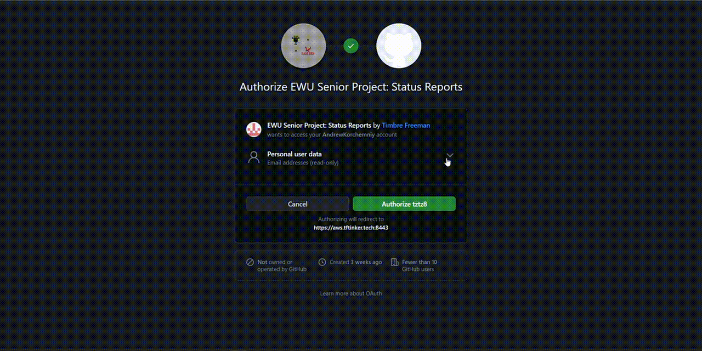
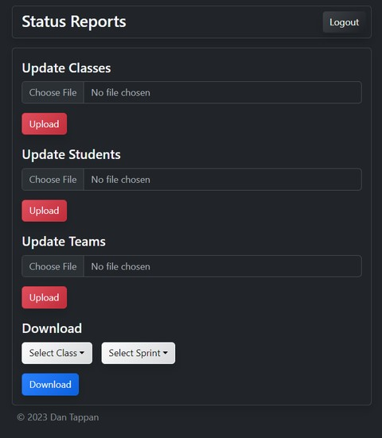

# User Guide

The following is a user guide for how admins can use the application.

## `Signing In`

The first step is to log in to the application.  
The login is handled by OAuth2 and is currently configured to use GitHub as the OAuth2 provider.  
Users are redirected to GitHub to sign in and then redirected back to the application.  
The OAuth2 provider can be changed in the future.  

## `Home Page`

The home page contains an admin panel for managing the classes, students, teams, and sprints.  
This page is currently incomplete and cannot be used.  
Preview of what the page will look like.

