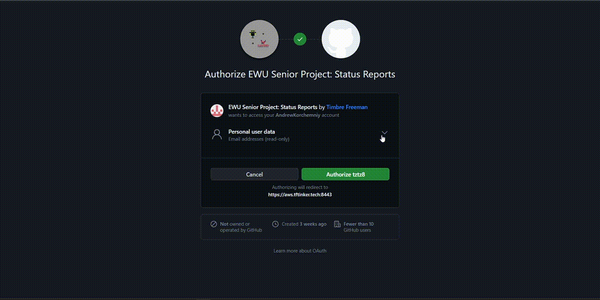

# User Guide

The following is a user guide for how students can use the application.

## Signing In

The first step is to log in to the application.  
The login is handled by OAuth2 and is currently configured to use GitHub as the OAuth2 provider.  
Users are redirected to GitHub to sign in and then redirected back to the application.  
The OAuth2 provider can be changed in the future.  

## Home Page

The home page contains a list of all the sprints for the current quarter.  
If a user successfully submitted a sprint, the sprint will be marked as completed.  
If the sprint was not submitted, the sprint will be marked as incomplete.  
All active sprints that can be submitted on the current date will be marked as available.

If the OAuth2 authentication fails, the user will be redirected to the error page.

If the frontend is unable to fetch the active sprints, an error messsge will be displayed.

## Team Report

On the home page, if a team report is open to submission, there will be blue arrow to the right that students can click on to complete a team report. As students answer the questions, the form will perform proactive validation. Once a student answered all the questions, they can submit the form. During the submission, the user will be redirected to the submission page, which will display the status of the submission.

If the team report submission fails, an error message will be displayed.

## Individual Report

Currently unavailable.  
Preview of what the page will look like.

## Requirements Page

Currently unavailable.  
Preview of what the page will look like.

