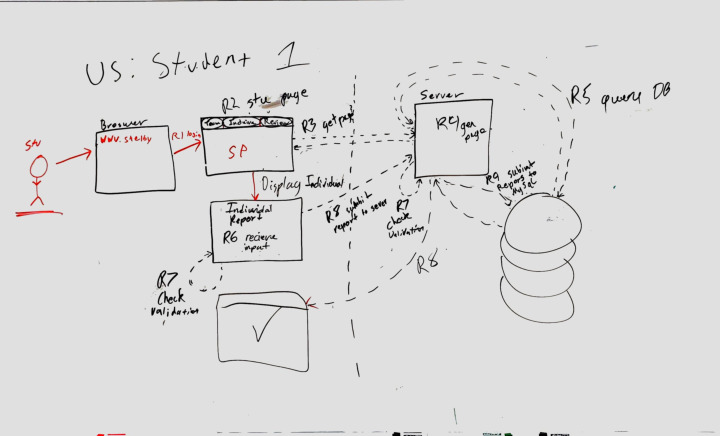
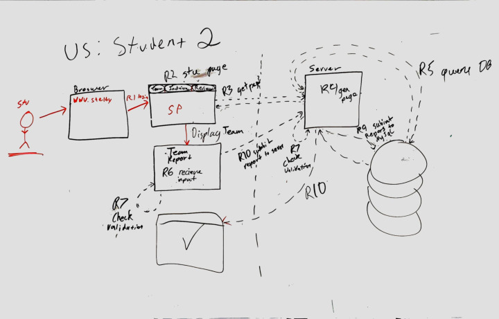
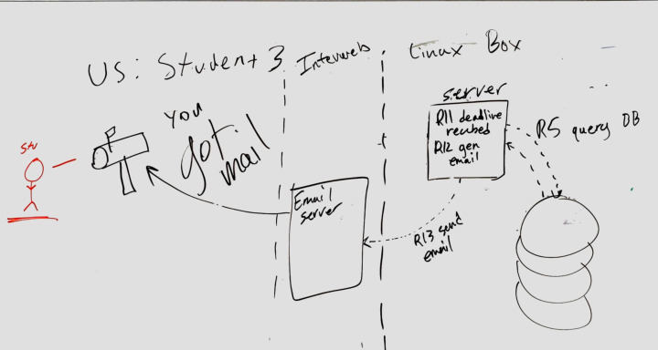
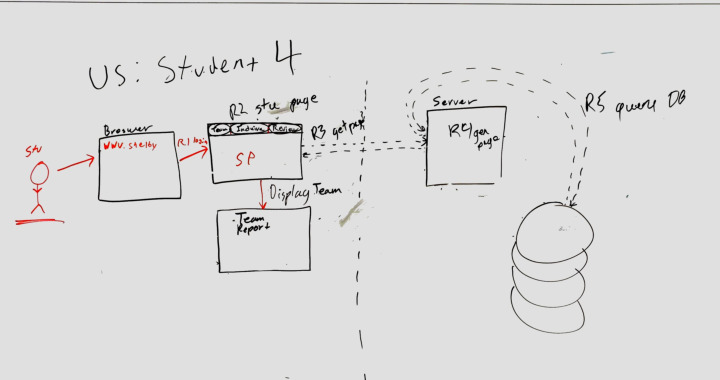
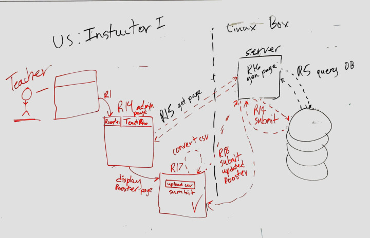
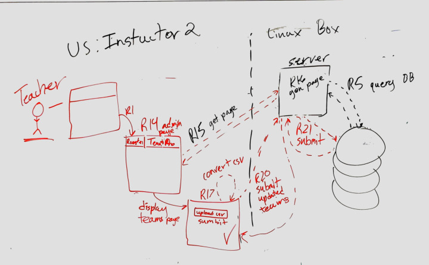
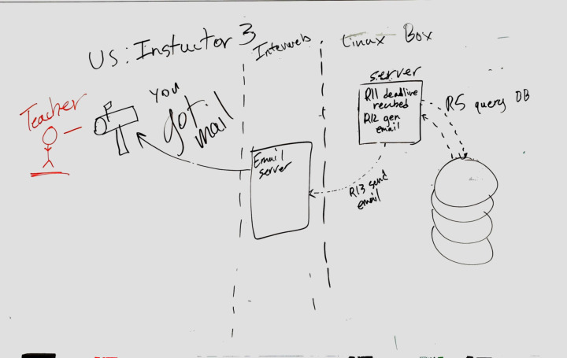
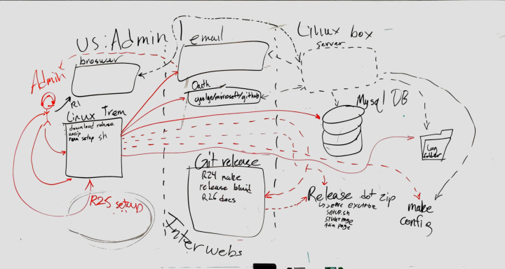
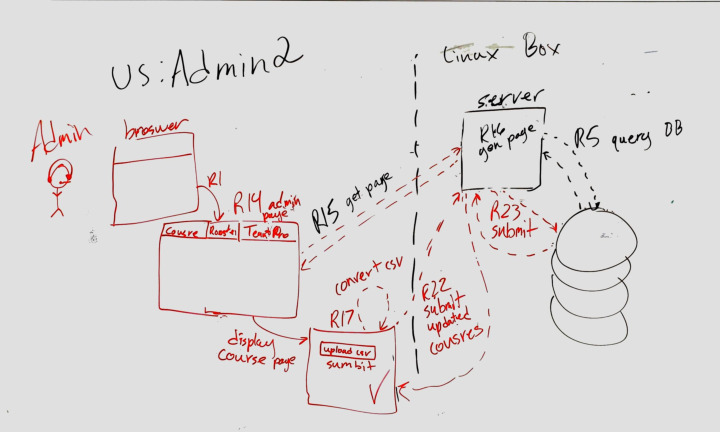
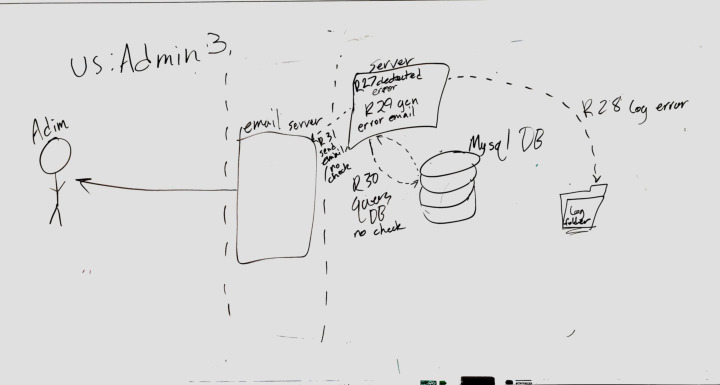

# User Stories

## Project Description

The existing Status Reporting System of the Shelby website is out-of-date and requires an update to modern standards. Currently, the website can function but is becoming more unmanageable as it starts to show its age. The current user interface is complex and unclear, making it difficult for students to submit weekly reports. Our standalone solution will entirely replace the Status Reporting System component of the website using modern frameworks and features, enabling more effective error messages and an intuitive design for students to complete their status reports. The solution will also give instructors and Admins a more effortless way to create and manage active courses.

*What is user story?*

> *A user story is an informal, general explanation of a software  feature written from the perspective of the end user. Its purpose is to  articulate how a software feature will provide value to the customer.*

## Table of contents (Quick Links)

- [Project Description](#project-description)
- [TLDR](#tldr-min-required-user-stories)
- [Glossary](#glossary)
- [Student Stories](#student-1-need)
- [Instructor Stories](#instructor-1-need)
- [Admin Stories](#Admin-1-need)

## TLDR: Min Required User Stories

- Student
  - Submitting Individual Reports
    - Let user know as they fill it out when not done correct
  - Submitting Team Reports
    - Let user know as they fill it out when not done correct
  - Review old reports
  - Get public portions of team reports
    - Note can reuse Instructor get team report
- Instructor
  - update students
    - using a csv file
  - manage teams
  - get team reports
    - include individual reports
    - include private portions
- Admin
  - add classroom
    - Include adding instructor
  - get server errors
    - by email
  - setup/update server
    - Using the Linux terminal

## Glossary

- Agents/User:
  - Students: the students completing their weekly status reports
  - Instructors: the professors that analyze the status reports to give feedback
  - Administrator (admin): the manager of the website, superusers
- Terms/Projects: A group of students in a class that there reports interact 
- Parsing: deserialization of input data, pulling in new data
- CSV file: a data file that has a table, typically containing a class roster for this example

## **Student #1,** **NEED**

| **Use Case Title:**  | Individual report                                            |
| -------------------- | ------------------------------------------------------------ |
| **Actors:**          | Student                                                      |
| **Purpose:**         | Submitting individual report as student                      |
| **Description:**     | Used for submitting a required weekly individual report as student |
| **Pre-conditions:**  | Student should exist, student should be enrolled in a class, and student should be in a team, student should be assigned a report assignment |
| **Task Sequence:**   | 1. Student opens Shelby in browser 2.R1: Student logs in 3.R2: Student gets sent to student page 4.R3: get page request 5.R4: generate page 6.R5: query database  7. Student enters the Individual report 8.R6: receive the generated page for individual report  9. R7: check validation.  10. R8: submit the Individual report 11.R7: check validation  12. R9: submit request to MySQL 13.R8: Individual report submitted 14. confirmation report was submitted correctly |
| **Alternate Flow:**  | 1. Student does not complete the form entirely, and returns later to finish 2. Student does not click on submit 3. Student clicks on cancel |
| **Post-conditions:** | 1. The form needs to be verified for completion 2. Client-side error should be displayed on any incomplete fields 3. The report will be submitted and saved |

## **Student #2,**  **NEED**

| **Use Case Title:**  | Team report                                                  |
| -------------------- | ------------------------------------------------------------ |
| **Actors:**          | Student                                                      |
| **Purpose:**         | Submitting team report as student                            |
| **Description:**     | Submitting a required team report as single student for entire team |
| **Pre-conditions:**  | Student should exist, student should be enrolled in a class, student should be in a team, student should be assigned a report assignment |
| **Task Sequence:**   | 1. Student opens Shelby in browser 2.R1: Student logs in 3.R2: Student gets sent to student page 4.R3: get page request 5.R4: generate page 6.R5: query database  7. Student enters the Team report 8.R6: receive the generated page for individual report  9. R7: check validation.  10. R10: Team submit the report 11.R7: check validation  12. R9: submit request to MySQL 13.R10: Team report submitted 14. confirmation report was submitted correctly |
| **Alternate Flow:**  | 1. Student does not complete the form entirely, and returns later to finish 2. Student does not click on submit 3. Student clicks on cancel |
| **Post-conditions:** | 1. The form needs to be verified for completion 2. Client-side error needs to be displayed on any incomplete fields 3. The report needs to be submitted and saved 4. The report needs to be updated and be viewable for all team members |

## **Student #3,**  **NEED**

| **Use Case Title:**  | Receiving emails about reports                               |
| -------------------- | ------------------------------------------------------------ |
| **Actors:**          | Student                                                      |
| **Purpose:**         | Creating a record of submissions                             |
| **Description:**     | Student receives an email for all individual and team report submissions |
| **Pre-conditions:**  | Student should exist, student should be enrolled in class, student should be in a team, student's email should be attached to SRS account |
| **Task Sequence:**   | 1. Student submits report 2. R5: database query 3. R11: deadline reached 4. R12: gen email 5. R13 send email 6. you got mail! |
| **Alternate Flow:**  | N/A                                                          |
| **Post-conditions:** | N/A                                                          |

## **Student #4,**  **NEED**

| **Use Case Title:**  | Viewing prior submissions                                    |
| -------------------- | ------------------------------------------------------------ |
| **Actors:**          | Student                                                      |
| **Purpose:**         | Making it possible to view prior submissions                 |
| **Description:**     | Student can view prior submissions via weekly report schedule |
| **Pre-conditions:**  | Student exists, student is enrolled in class, student is in a team, and student has completed a report |
| **Task Sequence:**   | 1. Student needs to view the weekly schedule 2. Student needs to click view on a report from a previous or current week 3. Student will be presented with the submitted form |
| **Alternate Flow:**  | N/A                                                          |
| **Post-conditions:** | N/A                                                          |

## **Student #5,**  **WANT**

| **Use Case Title:**  | Viewing incomplete form fields client-side                   |
| -------------------- | ------------------------------------------------------------ |
| **Actors:**          | Student                                                      |
| **Purpose:**         | Making it easier to identify incomplete form fields          |
| **Description:**     | The form should be dynamically updated client-side to display any incomplete fields before any form submissions are ever sent to server |
| **Pre-conditions:**  | Student should exist, student should be enrolled, student should be in a team, student should be assigned a report assignment |
| **Task Sequence:**   | 1. Student needs to view the weekly schedule 2. Student needs to open and view a report assignment 3. Student will be presented with required and optional fields 4. Student needs to begin filling out form 5. Student will be presented with a dynamic webpage that updates according to any incomplete or improperly filled form fields |
| **Alternate Flow:**  | N/A                                                          |
| **Post-conditions:** | 1. When submit button is clicked, check on the client-side for any incomplete or improperly filled form fields and notify user precisely 2. Submit button should not actually submit if the form is not complete |

---

## **Instructor #1,** **NEED** 

| **Use Case Title:**  | Creating a class                                             |
| -------------------- | ------------------------------------------------------------ |
| **Actors:**          | Instructor                                                   |
| **Purpose:**         | To create a class                                            |
| **Description:**     | Creating a class with a form                                 |
| **Pre-conditions:**  | Instructor should exist, admin should give instructor required permissions |
| **Task Sequence:**   | 1. Instructor needs to click on create class button 2. Instructor needs to fill out a form 3. Instructor needs to click submit, and will be presented with a new class according to specified form details |
| **Alternate Flow:**  | 1. Instructor hits cancel  2. Instructor does not correctly complete form and has to retry |
| **Post-conditions:** | 1. The form needs to be parsed and class needs to be created 2. The class needs to be displayed to the instructor in organized fashion |

> TODO: fix

## **Instructor #2,**  **NEED**

| **Use Case Title:**  | Adding students to class using CSV                           |
| -------------------- | ------------------------------------------------------------ |
| **Actors:**          | Instructor                                                   |
| **Purpose:**         | To add student to class                                      |
| **Description:**     | Using a CSV file to add students to class                    |
| **Pre-conditions:**  | Instructor should exist, admin should give instructor required permissions, instructor should have CSV file of student list |
| **Task Sequence:**   | 1. Instructor needs to click on add students button 2. Instructor needs to upload CSV file of student list4. Instructor needs to click submit |
| **Alternate Flow:**  | Instructor hits cancel button                                |
| **Post-conditions:** | 1. CSV file needs to be parsed 2. Class creation form should decide relevant details about a class such as class name, class duration, etc |

> TODO: fix

## **Instructor #3,**  **NEED**

| **Use Case Title:**  | Creating teams using CSV                                     |
| -------------------- | ------------------------------------------------------------ |
| **Actors:**          | Instructor                                                   |
| **Purpose:**         | To organize the students into teams                          |
| **Description:**     | Uploading a CSV file to create the class teams               |
| **Pre-conditions:**  | Instructor should exist, admin should give instructor required permissions, instructor should have CSV file of student teams |
| **Task Sequence:**   | 1. Instructor needs to click on create teams button 2. Instructor needs to upload CSV file of student teams 3. Instructor needs to click submit and will be presented with new teams |
| **Alternate Flow:**  | Instructor hits cancel button                                |
| **Post-conditions:** | 1. CSV file needs to be parsed 2. Teams should be created according to CSV |

> Instructor #3, NEED
> Use Case
> Title:
> gets reports
> Actors: Instructor, admin
> Purpose: sends an email at deadline of the progress and detail report of all teams
> **Description: Instructor receives emails on class progress
> Preconditions:
> Instructor is the teach of class, Instructor profile has been completed
> Task
> Sequence:
> R11: the deadline set on the server passes
> R5: the server queries the database for the individual and team reports
> R12: the server generates the emails with that individual and team reports
> R13: sends email to an email servers
> Alternate
> Flow:
> N/A
> Postconditions:
> Instructor gets reports

---

## **ADMIN #1, NEED**

| **Use Case Title:**  | login                                                        |
| -------------------- | ------------------------------------------------------------ |
| **Actors:**          | ADMIN                                                        |
| **Purpose:**         | To gain access to the site                                   |
| **Description:**     | enter into the site and gain access                          |
| **Pre-conditions:**  | ADMIN should have access to everything to the site           |
| **Task Sequence:**   | 1: ADMIN needs to enter their password and click the submit button or enter. 2: the ADMIN will be granted access to System Reports as ADMIN. |
| **Alternate Flow:**  | The ADMIN changes mind and hits cancel                       |
| **Post-conditions:** | 1: login credentials are verified  2: login error will show if not verified 3: the admin will be given administration rights to the System Reports |

> MISSING

## **Admin #2, NEED**

| **Use Case Title:**  | View                                                         |
| -------------------- | ------------------------------------------------------------ |
| **Actors:**          | ADMIN                                                        |
| **Purpose:**         | Be able to view the reports                                  |
| **Description:**     | The ADMIN to be able to see the report on the screen         |
| **Pre-conditions:**  | The ADMIN should be able to see the reports on the site      |
| **Task Sequence:**   | 1: ADMIN login into the site and then click on which reports he wants to view 2: the ADMIN viewing the report |
| **Alternate Flow:**  | N/A                                                          |
| **Post-conditions:** | 1: clicks and sees the team report 2: clicks and sees the individual report |

> Admin #2, NEED
> Use Case
> Title:
> Makes course
> Actors: Admin
> Purpose: allows the admin to create a 
> Description:
> the purpose of this is so that the teacher may populate a course with the class to do so the admin must first set up the course
> Preconditions:
> The is that there is no course for class that is going to be taken.
> Task
> Sequence:
> R1: authorized user login.
> R14: view authorized users page.
> R15: get the users page from the server.
> R16: Generates the users page at the server.
>     R5: queries the database 
> R17: uploads and converts a CSV file for the course
> R22: submits the courses updates to the server
> R23: server submits changes to the database.
> Alternate
> Flow:
> N/A
> Postconditions:
> the course is now ready to be filled by the teacher with students and teams.

## **ADMIN #3, NEED**

| **Use Case Title:**  | Edit                                                         |
| -------------------- | ------------------------------------------------------------ |
| **Actors:**          | ADMIN                                                        |
| **Purpose:**         | To change reports                                            |
| **Description:**     | To be able to change the reports and even answers to the report |
| **Pre-conditions:**  | The ADMIN should be able to edit reports                     |
| **Task Sequence:**   | 1: ADMIN clicks edit report and edit the report 2: edits report and saves it |
| **Alternate Flow:**  | 1: ADMIN edits the report but doesn't click save 2: If they leave, ask ADMIN if they want to save. |
| **Post-conditions:** | ADMIN changed the report                                     |

> Admin #3, NEED
Use Case
Title:
Emails regarding server errors
Actors: Admin
Purpose: To get an email regarding any server errors
Description:
If a severe server error occurs, the admin should receive an email describing
the error
Preconditions:
The admin superuser account should exist, superuser account should add
an email to the emailing list for server errors
Task
Sequence:
R27: An error is registered/detected on the server.
R28: A log of the error is created and stored within the log
R29: an e-mail is generated by the server detailing the error
R30: an error query is sent to the database.